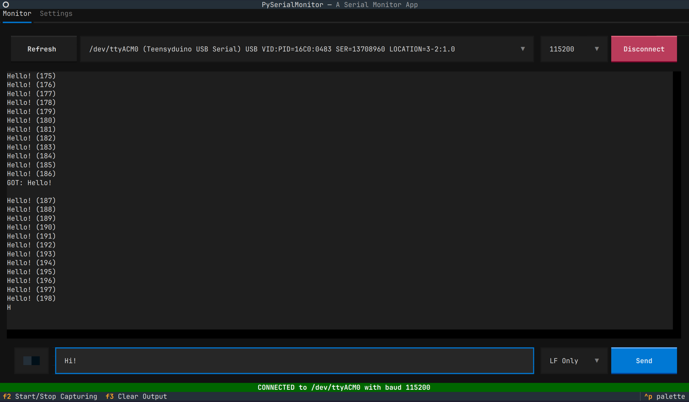

# Python-SerialMonitor

**Python-SerialMonitor** is a Python-based TUI (Text User Interface) Serial Monitor application designed for interacting with serial devices (e.g., microcontrollers like Teensy, Arduino) in a clean, keyboard-driven terminal interface.

With Python **Textual** framework, you can even use mouse!

## Screenshot



## Features

- Real-time serial data display with timestamps (coming soon).
- Auto reconnection on disconnection.
- Simple, responsive interface with keyboard shortcuts.
- Serial port selection from available devices.
- Adjustable baud rate support.
- Input box to send data to the serial device.
- Supports `LF`, `CR`, or `CRLF` line endings.
- Capturing output to a file.

## Requirements

- Python >= 3.10
- Can be installed with pip

## Installation

You can install via `pip`:
(1.) Latest official release on PyPI
```bash
pip install --upgrade python-serialmonitor
```
(2.) Directly from the git repository
```bash
pip install --upgrade git+https://gitlab.com/vtneil/python-serialmonitor.git
```
Or you can install with your favorite package manager, e.g., `uv`.

## Running

You can launch the TUI via command:

```bash
serialmonitor
```
Or
```bash
python -m serialmonitor
```